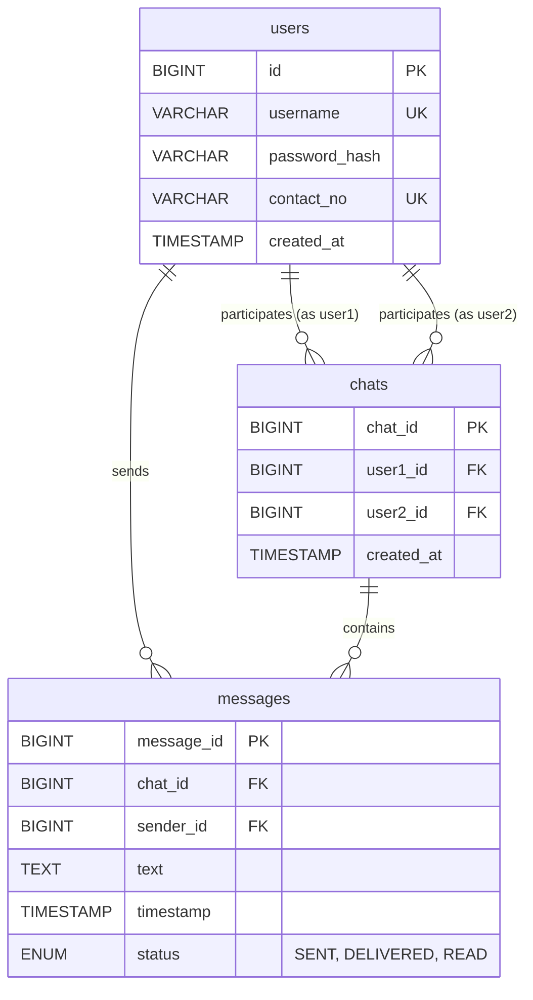
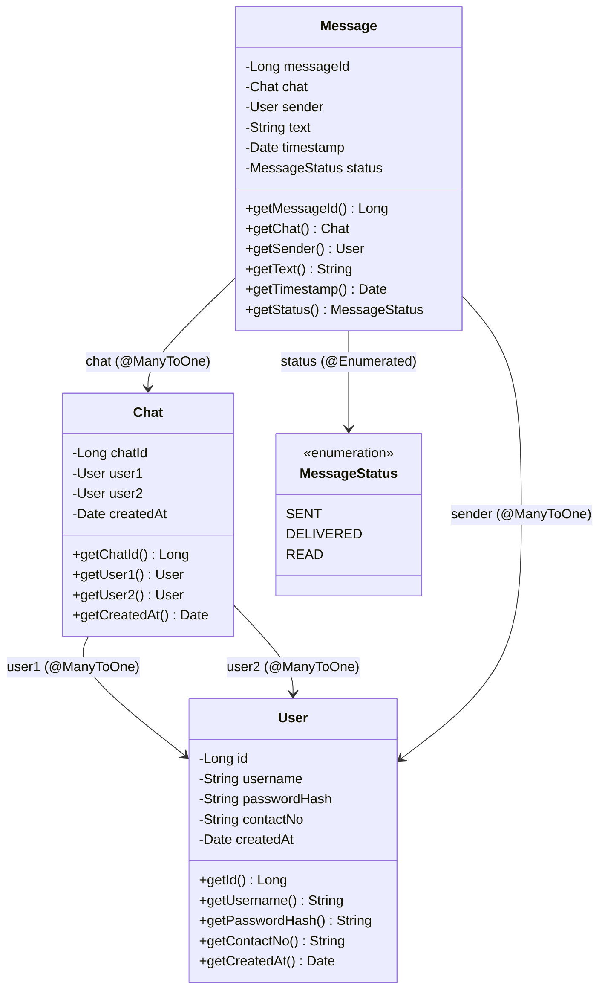

# SwiftChat — System Architecture & Design Documentation (Phase 1)

**Course:** Handheld Device Programming I  
**Project:** SwiftChat — Real-Time Mobile Chat Application  
**Architectural Stage:** Phase 1 (Foundation, Schema, and Entity Models)

---

## 1. System Architecture Overview

SwiftChat is built on a 3-tier distributed client-server architecture:

```
+--------------------------------------------------------------+
|                    Client Layer (Mobile App)                 |
|             React Native + React Navigation v6               |
|      - Fetch API (REST Authentication & History)             |
|      - Native WebSocket API (Live Real-Time Messaging)       |
+------------------------------+-------------------------------+
                               |
                   HTTP / REST | WebSocket (ws://)
                               |
+------------------------------v-------------------------------+
|                    Server Layer (Backend)                    |
|             Jakarta EE 10 / Java 17 / Apache Tomcat          |
|      - Java Servlets (Auth, Chat Sessions, Contacts)         |
|      - Jakarta WebSocket ServerEndpoint (Live Messaging)     |
|      - Hibernate ORM 6.4 (Jakarta Persistence 3.1)           |
|      - BCrypt Password Hashing (jBCrypt)                     |
+------------------------------+-------------------------------+
                               |
                               | JDBC Driver (MySQL Connector/J 8.x)
                               |
+------------------------------v-------------------------------+
|                    Database Layer (MySQL 8)                  |
|                 Database: swiftchat_db (InnoDB)              |
|      - Tables: users, chats, messages                        |
|      - Referential Integrity, Check Constraints, Indexes     |
+--------------------------------------------------------------+
```

---

## 2. Compatibility Decision: Pure Jakarta EE 10 Ecosystem

### Decision
**Adopt pure Jakarta EE 10 (`jakarta.*`) throughout the entire backend.**

### Technical Rationale
1. **Java 17 & Hibernate 6.x Requirement:** Modern Hibernate ORM 6.x is designed specifically for Java 17+ and strictly mandates the `jakarta.persistence` namespace (JPA 3.0/3.1). The older `javax.persistence` namespace was completely dropped in Hibernate 6.
2. **Elimination of Namespace Collisions:** Mixing `javax.websocket` with `jakarta.servlet` or `jakarta.persistence` on modern application servers (such as Apache Tomcat 10.1) results in `ClassNotFoundException`, `IncompatibleClassChangeError`, or server startup rejections.
3. **Application Server Alignment:** Apache Tomcat 10.1.x targets Jakarta EE 10 natively, providing runtime support for `jakarta.servlet` 6.0 and `jakarta.websocket` 2.1.
4. **Consistency:** All dependencies in `pom.xml` adhere strictly to the unified Jakarta EE namespace.

---

## 3. Database Schema & Entity-Relationship (ER) Design

### Tables Summary
* **`users`**: Unique identification of registered users (`id`, `username`, `password_hash`, `contact_no`, `created_at`).
* **`chats`**: Unique 1-on-1 private channels between two users (`chat_id`, `user1_id`, `user2_id`, `created_at`).
* **`messages`**: Individual text messages with state tracking (`message_id`, `chat_id`, `sender_id`, `text`, `timestamp`, `status`).

### Mermaid ER Diagram


---

## 4. Entity Class Model



---

## 5. Security & Configuration Safety
* Real credentials are never committed.
* `.env.example` provides template variables (`DB_HOST`, `DB_PORT`, `DB_NAME`, `DB_USER`, `DB_PASSWORD`).
* `hibernate.cfg.xml` utilizes parameter placeholders with safe local defaults.
* In Phase 2, passwords will be hashed with standard BCrypt (`jBCrypt`).
